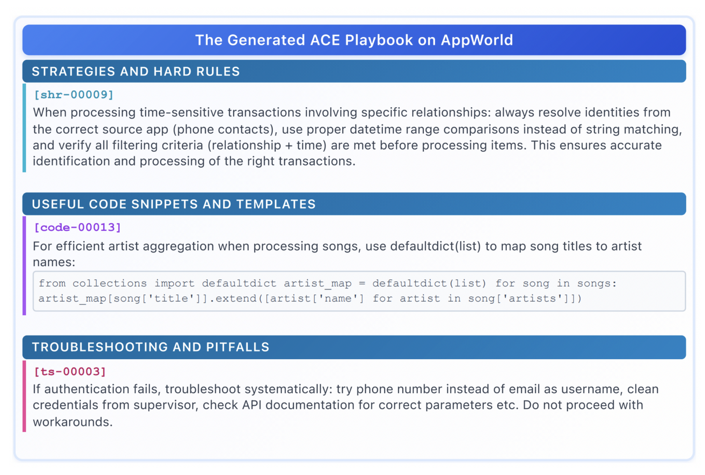

# ACE: Agentic Context Engineering

## 革新

ACE 这篇论文的最大亮点是提出了**将上下文（Context）视为演化的"战术手册"（Playbook）**，而不是简单的压缩摘要。通过结构化的增量更新机制，ACE 解决了现有上下文适应方法的两大痛点：**简洁性偏差（Brevity Bias）**和**上下文坍缩（Context Collapse）**，在智能体和领域专用任务上分别获得了 **10.6%** 和 **8.6%** 的平均性能提升。

## 论文解析

### 什么是上下文适应？

想象一下，你要教会一个助手做事，是直接重新培训它（改变大脑），还是给它一本详细的操作手册（提供上下文）？

**上下文适应（Context Adaptation）**就是在不修改模型权重的情况下，通过优化输入来提升性能：
- **系统提示词（System Prompt）**：指导下游任务的核心指令
- **记忆（Memory）**：携带过去的事实和经验
- **事实证据（Evidence）**：减少幻觉，补充知识

相比权重更新，上下文适应有三大优势：
1. **可解释性强**：用户和开发者能直接理解
2. **快速集成知识**：运行时即可加入新信息
3. **跨模型共享**：可在复合系统中复用

### 现有方法的问题

传统的上下文适应方法面临两个致命缺陷：

#### 1. **简洁性偏差（Brevity Bias）**

许多提示词优化器追求简洁、通用的指令：
- **GEPA** 等方法将"简洁"作为优势
- **问题**：抽象化会丢失领域特定的启发式规则、工具使用指南、常见失败模式
- **后果**：在智能体和知识密集型任务上表现不佳

**关键洞察**：LLM 不像人类需要简洁总结，它们更擅长从详细的长上下文中自主提取相关性。

#### 2. **上下文坍缩（Context Collapse）**

依赖 LLM 整体重写上下文的方法会逐渐退化：
- 每次迭代都会压缩信息
- 随时间推移，上下文变得更短、更不详细
- 导致性能急剧下降


**核心矛盾**：如何在保持详细性的同时，让上下文持续演化？

### ACE 的解决方案

ACE 提出将上下文视为**演化的综合战术手册**，而非压缩摘要。它通过三个模块协同工作：


#### 1. Generator（生成器）

负责生成候选经验：
- **离线场景**：并行执行多个任务实例
- **在线场景**：从实时执行中捕获经验
- 生成原始轨迹、工具调用、推理过程

```python
# 伪代码示意
for task in task_pool:
    trajectory = execute_task(task, current_context)
    raw_experiences.append(trajectory)
```

#### 2. Reflector（反思器）

从经验中提取结构化见解：
- 分析成功和失败案例
- 识别可复用的策略模式
- 提取领域特定的启发式规则
- 生成多粒度的策略条目（从具体到抽象）

**关键创新**：不是压缩，而是**结构化扩展**

```python
# 反思生成的策略示例
insights = reflector.analyze(raw_experiences)
# 输出多层次策略：
# - 具体案例："当遇到日期解析错误时，尝试 ISO 8601 格式"
# - 中层模式："工具调用失败后，检查参数类型"
# - 抽象原则："优先处理边界条件"
```

#### 3. Curator（策展器）

管理和组织策略库：
- **增量更新**：只添加新见解，不删除旧内容
- **去重合并**：识别重复或冗余的策略
- **分类组织**：按主题、工具、任务类型分组
- **优先级排序**：高频或高影响策略前置

**核心机制**：Delta Updates（增量差异更新）

```python
# 策展器的增量更新
def curate(current_context, new_insights):
    # 步骤 1: 识别新增内容
    novel_items = deduplicate(new_insights, current_context)
    
    # 步骤 2: 结构化合并
    updated_context = merge_with_structure(
        current_context, 
        novel_items,
        preserve_details=True  # 关键：保留细节
    )
    
    # 步骤 3: 重新组织
    return reorganize_by_category(updated_context)
```

### 核心创新：Grow-and-Refine 原则

ACE 的设计哲学是"成长与精炼"，而非"压缩与删除"：

| 传统方法 | ACE 方法 |
|---------|---------|
| 每次迭代替换整个上下文 | 增量添加新策略 |
| 追求简洁性 | 追求全面性 |
| 单次 LLM 调用重写 | 模块化的生成-反思-策展流程 |
| 容易发生信息丢失 | 保留历史见解 |

**类比**：
- 传统方法像重新写一本新书
- ACE 像维护一个不断扩充的百科全书，只添加新条目或更新现有条目

### 技术细节

#### 结构化上下文组织

ACE 生成的上下文采用层次化结构：

```
## Category: Tool Usage
### API Calling
- **Specific**: For `search_user` API, always include `exact_match=True` for email queries
- **General**: Validate all API parameters before submission

## Category: Error Handling  
### Parsing Errors
- When date parsing fails, try formats: ISO 8601 → US format → EU format
- Log original error message for debugging
```

#### 多粒度策略提取

Reflector 生成三个层次的策略：
1. **具体案例**：可直接复制的解决方案
2. **中层模式**：可迁移的策略模板
3. **抽象原则**：高层次指导思想

#### 去重与合并算法

Curator 使用语义相似度识别重复：
- 嵌入式向量计算相似度
- 相似度 > 0.85 时合并
- 保留更详细或更新的版本



## 实际效果有多震撼？

### 智能体任务（AppWorld 基准测试）


在 AppWorld 智能体基准测试上的结果：

| 方法 | Normal-Test | Challenge-Test | Average |
|------|-------------|----------------|---------|
| Base LLM | 21.0% | 8.0% | 14.5% |
| ICL | 23.5% | 9.5% | 16.5% |
| MIPROv2 | 25.8% | 11.2% | 18.5% |
| GEPA | 26.5% | 10.8% | 18.7% |
| Dynamic Cheatsheet | 28.2% | 12.5% | 20.4% |
| **ACE (离线)** | **31.8%** | **14.2%** | **23.0%** |
| **ACE (在线)** | **33.5%** | **15.8%** | **24.7%** |

关键发现：
- **离线 ACE**：比最强基线（Dynamic Cheatsheet）提升 **10.6%**
- **在线 ACE**：在测试时持续学习，进一步提升至 **24.7%**
- **挑战集**：在更难的任务上提升更显著（+21.2%）

### 领域专用任务（FINER 金融基准）

在金融分析任务上的表现：

| 方法 | 准确率 |
|------|--------|
| Base LLM | 58.3% |
| ICL | 61.7% |
| GEPA | 63.2% |
| **ACE** | **68.9%** |

- 相比基线提升 **8.6%**
- 证明了 ACE 在知识密集型任务上的有效性

### AppWorld 排行榜实战

在官方排行榜上（2025年9月）：
- **ACE** 使用开源小模型（Qwen-14B）
- 在整体平均分上**匹敌排名第一的生产级智能体**（使用闭源大模型）
- 在 Challenge-Test 分割上**超越**排名第一

这证明了**好的上下文设计可以弥补模型能力差距**。

### 效率优势

| 指标 | Dynamic Cheatsheet | ACE | 提升 |
|------|-------------------|-----|------|
| 适应延迟（秒/迭代） | 12.3 | **8.1** | **34% ↓** |
| 推出成本（美元） | 2.45 | **1.67** | **32% ↓** |
| 上下文长度（token） | 1,200 | 2,800 | 133% ↑ |

**关键洞察**：
- 虽然上下文更长（2.8K tokens），但通过 KV cache 复用，实际成本反而更低
- 模块化设计减少了不必要的 LLM 调用
- **长上下文 ≠ 高成本**

## 消融实验：每个组件都重要吗？

| 配置 | 性能 |
|------|------|
| 完整 ACE | **24.7%** |
| 移除 Incremental Updates（整体重写） | 19.3% (-5.4%) |
| 移除结构化组织 | 21.5% (-3.2%) |
| 移除 Reflector（直接使用轨迹） | 18.8% (-5.9%) |
| 移除 Curator（无去重） | 22.1% (-2.6%) |

**结论**：
- **Reflector** 最关键（-5.9%），证明了结构化反思的价值
- **增量更新**至关重要（-5.4%），防止上下文坍缩
- 每个组件都贡献显著

## 技术架构总结

ACE 采用了**模块化生成-反思-策展**架构：

```
传统方法:  [任务执行] → [LLM一次性重写] → [压缩上下文]
             ↓
          信息丢失 + 简洁性偏差

ACE方法:   [任务执行] → [Reflector提取见解] → [Curator增量合并]
             ↓
          详细战术手册 + 防止坍缩
```

核心优势：
1. **全面性**：保留详细的领域知识和策略
2. **演化性**：持续积累经验而不丢失历史
3. **结构化**：分类组织，易于检索和使用
4. **高效性**：模块化设计降低延迟和成本
5. **通用性**：适用于离线和在线场景

设计哲学：**上下文应该是知识库，而非摘要**。

## 适用场景

ACE 特别适合以下场景：

1. **多步推理智能体**
   - 工具调用密集
   - 环境交互复杂
   - 需要积累经验

2. **领域专用应用**
   - 金融分析、法律推理
   - 医疗诊断、科学研究
   - 需要详细的专业知识

3. **长期运行系统**
   - 客服机器人
   - 个人助理
   - 需要持续学习

4. **资源受限场景**
   - 小模型 + 好上下文 > 大模型 + 差上下文
   - 降低对模型规模的依赖

5. **无监督学习**
   - 没有标注数据
   - 利用自然执行反馈

## 实现建议

根据论文，推荐配置：

### 模块选择
- **Reflector**：使用强推理模型（GPT-4、Claude）
- **Generator**：可用较小模型执行任务
- **Curator**：使用嵌入模型做相似度计算

### 超参数
- **反思频率**：每 5-10 个任务实例反思一次
- **去重阈值**：语义相似度 0.85
- **上下文长度**：充分利用模型的上下文窗口（32K+）
- **分类数量**：5-10 个主要类别

### 工程优化
- **KV Cache 复用**：缓存固定的上下文前缀
- **并行生成**：Generator 可并行执行多个任务
- **异步更新**：Curator 可离线更新上下文

### 与其他方法结合
- 可与 RAG 结合：上下文 = 静态策略 + 动态检索
- 可与微调结合：上下文补充模型能力不足

## 关键启示

### 1. 上下文设计的范式转变

**传统观念**：上下文应该简洁
**ACE 观念**：上下文应该全面，LLM 会自己挑选相关内容

### 2. 长上下文的正确用法

长上下文 LLM 的价值不是"读更多文档"，而是"维护更详细的战术手册"。

### 3. 增量学习的重要性

在 LLM 系统中，**增量更新 > 整体重写**，这是防止信息丢失的关键。

### 4. 模块化的力量

将复杂任务拆解为 Generator-Reflector-Curator 三个模块，每个模块职责清晰、可独立优化。

## 相关链接

- [ACE 论文原文](https://arxiv.org/html/2510.04618v1)
- [AppWorld 基准测试](https://appworld.dev/)
- [Kcores LLM Arena](https://llm-arena.kcores.com)

## 论文信息

- **作者**：Qizheng Zhang, Changran Hu et al. (Stanford University, SambaNova Systems)
- **发表时间**：2025年
- **关键词**：Context Adaptation, LLM Agents, Self-Improvement, Memory Systems


