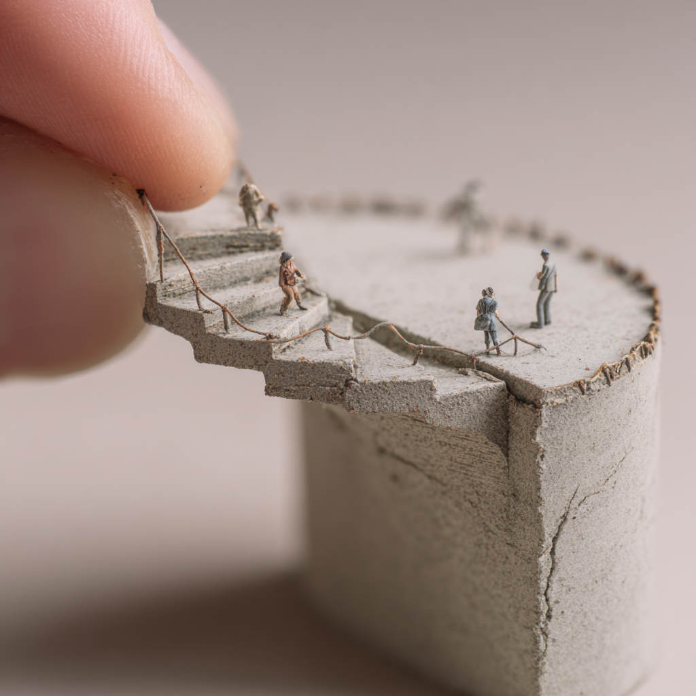

班门弄斧 (Teach Fish to Swim)
----------------------------




```prompt
Close-up shot, a small concrete square spiral staircase. Macro lens, shallow depth of field, miniature photography technique, photo-like realism. Bauhaus style. Tiny people walking on it. One hand holding the edge of the miniature bridge. Miniature world and architecture. Soft light. Delicate and charming atmosphere. --ar 1:1
```

**带大家精读论文**

## Desc


这个项目本身其实是我阅读论文整理笔记用的. 但有很多朋友感兴趣, 于是就开源了出来. 大家共同学习, 共同进步.

由于作者能力有限, 所以如果有任何错误或者疏漏恳请大家指出. 也欢迎多多交流~

请注意, 这个项目中引用的论文内容, 图片或其它媒体所有权均属于论文作者. 

整理好的网页版可以访问 [swim.kcores.com](https://swim.kcores.com)

## License

CC-BY-NC-SA-4.0 @karminski


