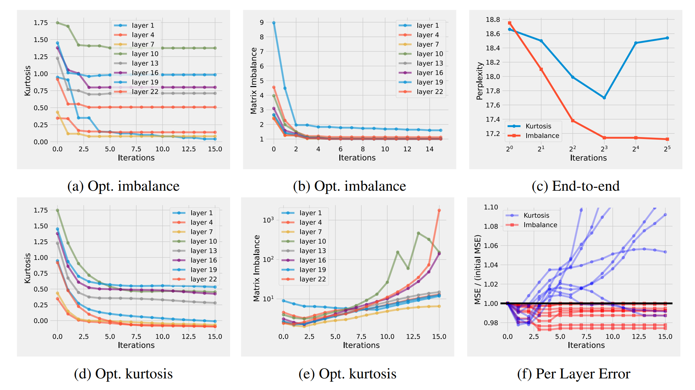

# SINQ: Sinkhorn-Normalized Quantization

## 革新

SINQ 这篇论文的最大亮点是在**无需校准数据**的情况下，实现了接近甚至超越校准量化方法的精度，同时保持了简单高效的实现方式。

## 论文解析

### 什么是模型量化？

想象一下，如果你要搬家，是直接搬走所有家具（包括笨重的衣柜、床），还是把东西打包压缩后再搬？

模型量化就像是给神经网络"打包压缩"：
- 原始模型用 16 位浮点数（bfloat16）存储权重
- 量化后用 4 位整数存储
- **存储空间减少 4 倍**，内存带宽需求降低 4 倍
- 理论上可以获得 **4 倍加速**

### 现有方法的问题

传统的权重量化有两大流派：

1. **简单但不够准**：Round-to-Nearest (RTN)
   - 直接四舍五入到最近的整数
   - 快速，但在 4 位及以下精度损失严重

2. **准但太复杂**：校准量化（如 AWQ）
   - 需要额外的校准数据集
   - 可能过拟合或引入偏差
   - 计算开销大

核心矛盾是：**如何在简单高效和高精度之间找到平衡？**

### SINQ 的解决方案

论文提出了三个核心创新：

#### 1. 双轴缩放（Dual-Scaling）

传统量化只沿一个维度缩放：
```
传统方法: W ≈ s ⊙ (Q + z)
           只有行缩放因子 s
```

SINQ 引入双轴缩放：
```
SINQ方法: W ≈ s ⊙ Q ⊙ t
          有行缩放 s 和列缩放 t
```

**为什么这么做？**

想象矩阵中有一个异常大的值（outlier）：
- 传统方法：必须放大整行的缩放因子，导致该行其他值精度损失
- 双轴方法：可以通过增大行缩放 s[i] 同时减小列缩放 t[j] 来平衡误差
- **核心思想**：在行和列之间"交易"量化误差


#### 2. 矩阵不平衡度（Matrix Imbalance）

如何判断一个矩阵"容易量化"？论文提出了一个新指标：

$$
\text{Imbalance}(W) = \sum_i \text{Var}(\text{row}_i) + \sum_j \text{Var}(\text{col}_j)
$$

- 低不平衡度 = 容易量化（行和列方差都小且均匀）
- 高不平衡度 = 难量化（存在高方差的行或列）

这个指标的妙处在于：
- 它既考虑了行的方差分布
- 也考虑了列的方差分布
- 双轴缩放正是为了**最小化这个不平衡度**

#### 3. Sinkhorn-Knopp 迭代算法

如何找到最优的双轴缩放因子 s 和 t？

论文采用了一个源自最优传输理论的经典算法：**Sinkhorn-Knopp 迭代**

```python
# 伪代码
s = ones(num_rows)
t = ones(num_cols)

for iteration in range(max_iterations):
    # 归一化行
    row_vars = compute_row_variances(W * t)
    s = 1.0 / sqrt(row_vars)
    
    # 归一化列
    col_vars = compute_col_variances(W * s)
    t = 1.0 / sqrt(col_vars)
```

这个算法：
- **快速收敛**：通常 10-20 次迭代即可
- **无需梯度**：纯数值迭代，无需反向传播
- **理论保证**：在特定条件下收敛到最优解

### 技术细节

#### 分块（Tiling）策略

不是对整个权重矩阵应用一组缩放因子，而是：
- 将大矩阵分成小块（例如 128×128）
- 每个块有自己的双轴缩放因子
- 平衡了精度和开销

#### 与校准方法结合（A-SINQ）

SINQ 还可以与现有校准方法（如 AWQ）结合：
1. 先用 AWQ 的激活感知搜索空间
2. 再用 SINQ 的双轴缩放优化
3. 取得 **1 + 1 > 2** 的效果

## 实际效果有多震撼？

### 精度提升

在 Qwen3 模型上的 WikiText2 困惑度（越低越好）：

| 模型 | 精度 | BF16 基线 | RTN | HQQ | SINQ (无校准) | AWQ (有校准) | A-SINQ |
|------|------|-----------|-----|-----|--------------|-------------|---------|
| Qwen3-1.7B | 4-bit | 16.67 | 17.28 | 17.16 | **16.94** | 17.05 | **16.89** |
| Qwen3-14B | 4-bit | 8.64 | 8.83 | 8.80 | **8.72** | 8.74 | **8.68** |
| Qwen3-32B | 4-bit | 7.60 | 7.73 | 7.70 | **7.65** | 7.66 | **7.62** |

关键发现：
- **SINQ（无校准）已经超过了 HQQ 和接近 AWQ**
- **A-SINQ（有校准）全面领先所有基线**
- 效果在更大模型上更明显



### 3-bit 量化也能用

甚至在极端的 3-bit 量化下：
- Qwen3-32B: 从 8.80 (RTN) 降到 **7.94** (SINQ)
- DeepSeek-V2.5: 困惑度接近 4-bit RTN 的效果

### 速度优势

- **量化时间**：比 AWQ 快 **~3 倍**（因为无需校准数据前向传播）
- **推理速度**：与 RTN 相同（都是简单的矩阵缩放）
- **内存开销**：仅增加少量辅助参数（每个分块两个向量）


## 技术架构总结

SINQ 采用了**双轴归一化**设计：

```
传统单轴量化: [权重矩阵] --行缩放--> [量化]
                ↓
              精度损失大

SINQ双轴量化:  [权重矩阵] --行列缩放迭代优化--> [量化]
                ↓
            矩阵不平衡度↓ → 精度损失↓
```

核心优势：
1. **简单**：无需校准数据，纯数学优化
2. **通用**：适用于任何线性层，任何架构
3. **高效**：快速迭代算法，量化时间短
4. **精准**：接近或超越校准方法

这种设计就像给矩阵做"平衡术"：通过行列双向调节，让每个元素都能被精确量化。

## 适用场景

SINQ 特别适合以下场景：

1. **快速部署**：没有时间或资源做校准
2. **无数据场景**：没有合适的校准数据集
3. **大规模部署**：需要量化大量模型
4. **边缘设备**：内存受限，需要低比特量化
5. **MoE 模型**：专家数量多，校准成本高

## 实现建议

根据论文，推荐配置：
- **分块大小**：128×128 或 64×64
- **迭代次数**：10-20 次（观察收敛）
- **量化格式**：INT4 或 NF4（normal float 4-bit）
- **结合使用**：可与 AWQ 等校准方法结合获得最佳效果

## 相关链接

- [SINQ 论文原文](https://arxiv.org/html/2509.22944v2)
- [GitHub 项目](https://github.com/huawei-csl/SINQ)
- [Kcores LLM Arena](https://llm-arena.kcores.com)


